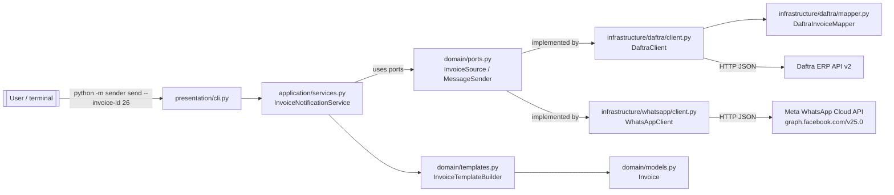
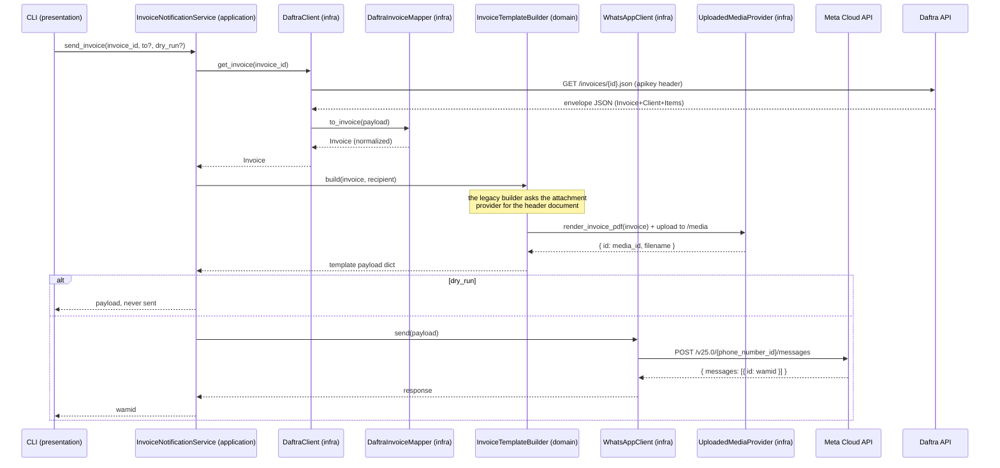
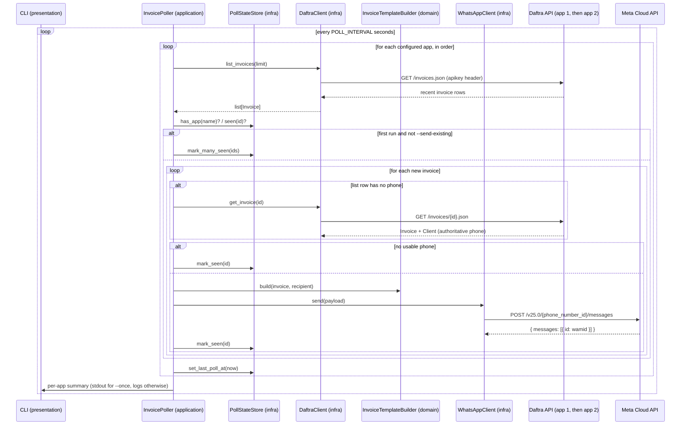

# Architecture

**Breadcrumb:** [Home](index.md) / [Architecture](architecture.md)

---

## At a glance

The system is a single Python package (`sender/`) run from the command line. It
acts as a thin orchestrator between two external systems it never owns:

- **Daftra ERP API v2** — the source of invoice data.
- **Meta WhatsApp Cloud API** — the channel that delivers the message.



## Layers (dependency rule)

Dependencies point **inward**; the domain knows nothing about the outside world.

```
presentation ──▶ application ──▶ domain
      │                │            ▲
      │                └────────────┤ (via ports)
      └──────────▶ infrastructure ──┘
```

| Layer | Contents | Dependencies |
|---|---|---|
| `domain` | `models.py`, `templates.py`, `phones.py`, `ports.py`, `errors.py` | none (stdlib only) |
| `application` | `services.py`, `poller.py` — use cases | `domain` only |
| `infrastructure` | `config.py`, `state.py`, `clock.py`, `daftra/`, `whatsapp/`, `util.py` | `domain` + HTTP libs |
| `presentation` | `cli.py`, `__main__.py` (delegates) | all layers (composition root) |

Rule of thumb: **application never imports infrastructure**. The composition root
(`presentation/cli.py`) wires concrete adapters into the service through the
`domain/ports.py` protocols, so either side can be swapped for tests or mock-ups.

## Runtime flow — the `send` command



The same pipeline powers `preview` (stops after building the payload) and `show`
(returns the invoice or its raw Daftra JSON without any WhatsApp involvement).
Both still resolve the header document, because the payload has to reference a
real `media_id` to be worth inspecting — only the final `send` is skipped.

The `P` step is the invoice-PDF upload and only happens on the legacy builder in
`upload` mode. It is not decoration: Daftra exposes no PDF export and its
`invoice_pdf_url` is session-gated, so neither Meta nor the sender can fetch the
file. The sender renders the PDF itself (`infrastructure/pdf.py`, standard
library only) and pushes the bytes to Meta in two phases. The PDF is in Arabic,
which a PDF viewer does not shape, so the render resolves contextual forms and
reorders the runs itself (`infrastructure/arabic.py`) and reads the embedded
font directly (`infrastructure/truetype.py`). See
[Invoice PDF](guide/invoice-pdf.md).

## Runtime flow — the `poll` command

`poll` is the automation entry point. It runs in cycles: for each configured
Daftra app **in configuration order, one after the other**, it lists recent
invoices (paging forward when the page is saturated, so a burst of new invoices
cannot fall off the page), decides which are new (via the per-app state store),
and sends each new invoice to its customer. The two tenants never share state
and never run concurrently.



The state store (`infrastructure/state.py`) is a JSON file keyed **per app name**,
so app 1 and app 2 never share "seen" sets. Per app it records `seen` (handled
ids), `pending` (retryable failures awaiting a backoff retry), `abandoned`
(permanent failures given up), and `last_poll_at`. It is written atomically via
a pid-qualified temp file, bounded to the most recent `POLL_MAX_SEEN` entries,
and a corrupt/missing file logs a warning and starts empty — the poller never
crashes because of its own bookkeeping. The CLI holds an advisory `flock`
(`poll_state.json.lock`) for the whole real `poll` run so two overlapping
pollers cannot double-send.

## Error handling

- A shared hierarchy lives in `domain/errors.py` (`ApiError` → `DaftraApiError`,
  `WhatsAppApiError`). Network failures, non-2xx responses, envelope-level
  `result: failed` replies, and validation problems all surface as typed errors.
- WhatsApp 429-rate-limit responses are retried (backoff honors `Retry-After`),
  then fail with `WhatsAppApiError` after the retry budget is exhausted.
- The CLI catches `ApiError`/`ValueError`/`RuntimeError`, prints a single error
  line to stderr, and exits with code `1`.

## Config flow

All external knobs come from environment variables (`.env`), centralized and
normalized by `infrastructure/config.py` (`Settings`, a frozen dataclass).
Secrets (API keys and tokens) are excluded from its `repr`. Daftra
authenticates with the API key sent as the `apikey` header — the simplest
supported method. WhatsApp credentials are lazily required — only
`send`/`preview`/`poll` demand them, so `show`/`list` work with just the Daftra
key. `Settings.apps` holds one `DaftraApp` per tenant (app 1 from the unprefixed
vars, extra apps from `DAFTRA2_*`/`DAFTRA3_*` slots); each app's name is
derived from its account subdomain. The non-poll commands use
`Settings.primary_app` (the first/only app). See the
[getting-started](guide/getting-started.md) page.

## Drill down

- [Back to overview](index.md)
- [Design decisions](design.md)
- [Guide — getting started](guide/getting-started.md)
- [Layer — domain](layers/domain.md)
- [Layer — application](layers/application.md)
- [Layer — infrastructure](layers/infrastructure.md)
- [Layer — presentation](layers/presentation.md)