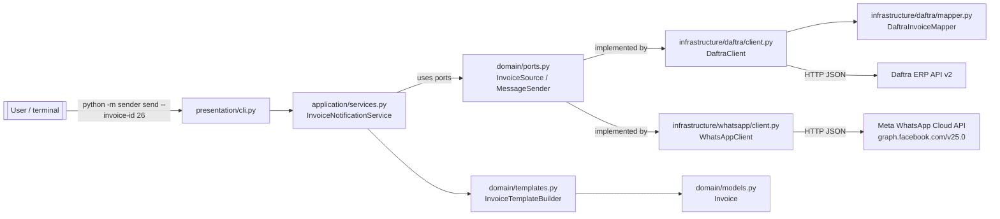
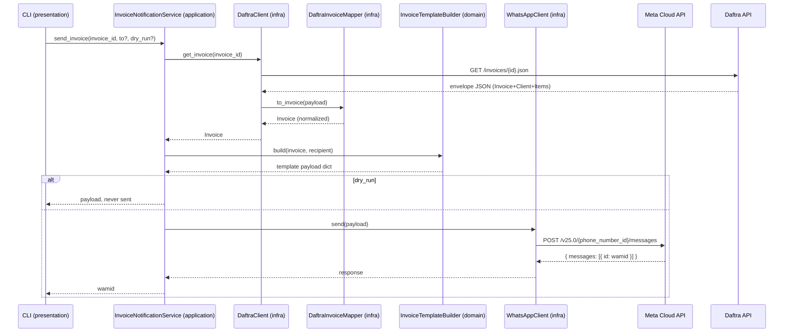

# Architecture

**Breadcrumb:** [Home](../index.md) / [Architecture](architecture.md)

---

## At a glance

The system is a single Python package (`sender/`) run from the command line. It
acts as a thin orchestrator between two external systems it never owns:

- **Daftra ERP API v2** — the source of invoice data.
- **Meta WhatsApp Cloud API** — the channel that delivers the message.



## Layers (dependency rule)

Dependencies point **inward**; the domain knows nothing about the outside world.

```
presentation ──▶ application ──▶ domain
      │                │            ▲
      │                └────────────┤ (via ports)
      └──────────▶ infrastructure ──┘
```

| Layer | Contents | Dependencies |
|---|---|---|
| `domain` | `models.py`, `templates.py`, `phones.py`, `ports.py`, `errors.py` | none (stdlib only) |
| `application` | `services.py` — use cases | `domain` only |
| `infrastructure` | `config.py`, `daftra/`, `whatsapp/`, `util.py` | `domain` + HTTP libs |
| `presentation` | `cli.py`, `__main__.py` (delegates) | all layers (composition root) |

Rule of thumb: **application never imports infrastructure**. The composition root
(`presentation/cli.py`) wires concrete adapters into the service through the
`domain/ports.py` protocols, so either side can be swapped for tests or mock-ups.

## Runtime flow — the `send` command



The same pipeline powers `preview` (stops after building the payload) and `show`
(returns the invoice or its raw Daftra JSON without any WhatsApp involvement).

## Error handling

- A shared hierarchy lives in `domain/errors.py` (`ApiError` → `DaftraApiError`,
  `WhatsAppApiError`). Network failures, non-2xx responses, envelope-level
  `result: failed` replies, and validation problems all surface as typed errors.
- WhatsApp 429-rate-limit responses are retried (backoff honors `Retry-After`),
  then fail with `WhatsAppApiError` after the retry budget is exhausted.
- The CLI catches `ApiError`/`ValueError`/`RuntimeError`, prints a single error
  line to stderr, and exits with code `1`.

## Config flow

All external knobs come from environment variables (`.env`), centralized and
normalized by `infrastructure/config.py` (`Settings`, a frozen dataclass).
Secrets (API keys, tokens) are excluded from its `repr`. WhatsApp credentials are
lazily required — only `send`/`preview` demand them, so `show`/`list` work with a
Daftra key alone. See the [getting-started](guide/getting-started.md) page.

## Drill down

- [Back to overview](../index.md)
- [Design decisions](design.md)
- [Guide — getting started](guide/getting-started.md)
- [Layer — domain](layers/domain.md)
- [Layer — application](layers/application.md)
- [Layer — infrastructure](layers/infrastructure.md)
- [Layer — presentation](layers/presentation.md)